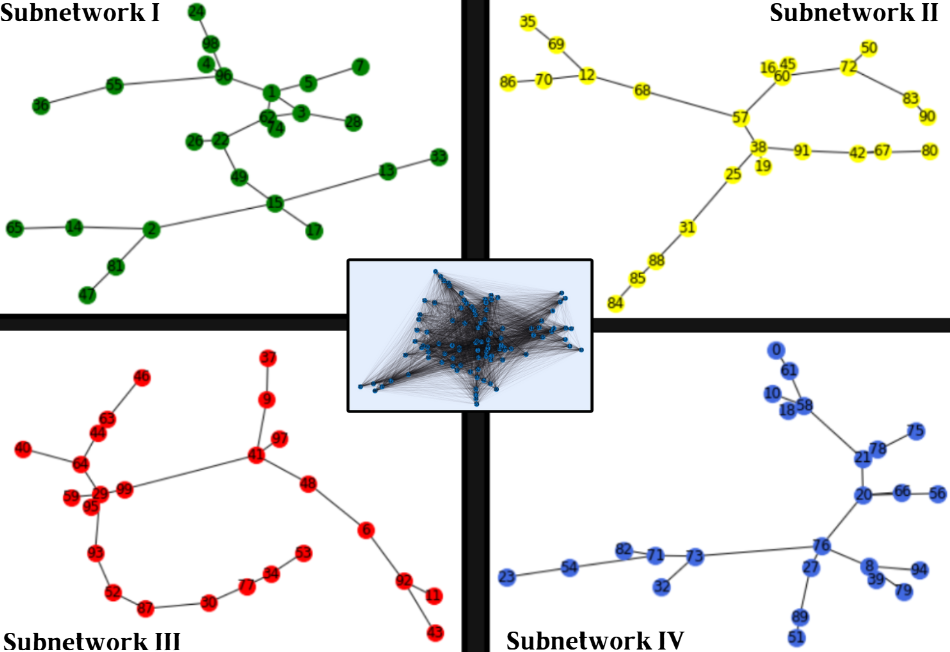
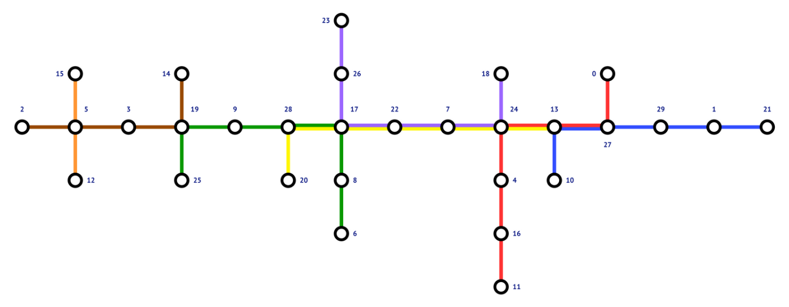

# Efficient-Transport-Network-Design-with-Quantum-Annealing

This repository focuses on designing efficient transport networks by formulating and solving a set of optimization problems. These problems are primarily addressed using D-Wave's hybrid quantum-classical optimizer.

## Installation: 

```bash
pip install .
```

## Problem Definitions & Results:
See `presentation/Efficient Transport Network with Quantum Annealing.pdf`

## Usage:
To run the optimization using the D-Wave hybrid solver:

1. Create an account on the D-Wave Leap platform: https://cloud.dwavesys.com/leap
2. Create a project and obtain your API token from the Leap dashboard.
3. Provide the API token in the arguments of the optimization functions.

Example usage can be found in: `demo/efficient_transport_network.ipynb` 

## Gallery:

